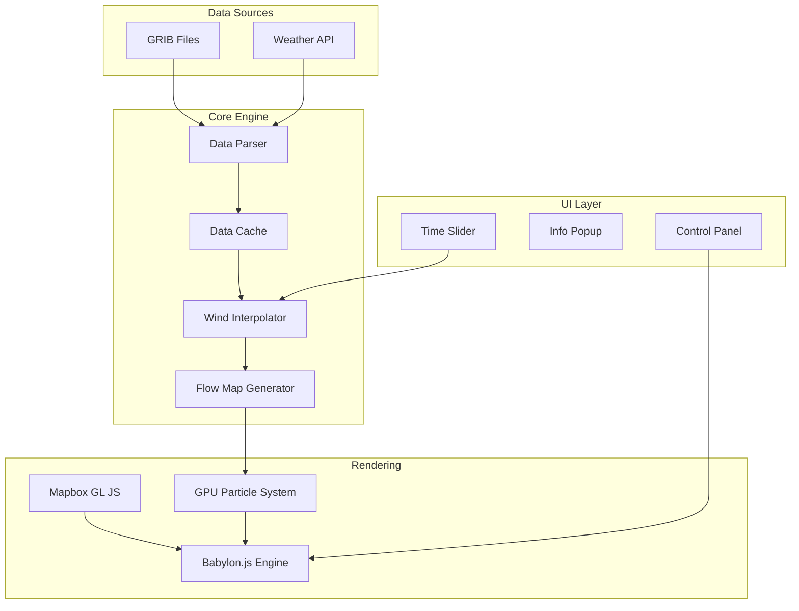
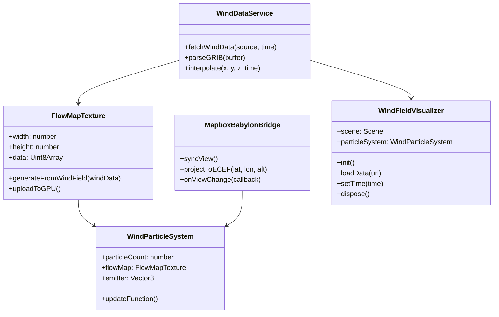

# Weather Wind Field Visualization - Technical Design Document

Feature Name: weather-wind-field-visualization
Updated: 2026-03-29

## 1. Description

本技术设计方案描述了一个基于 Babylon.js 和 Mapbox GL JS 的气象数据风场可视化系统。系统从 GRIB 数据或气象 API 获取全球风场数据，通过 GPU 粒子系统实现大规模粒子动画，并在地图上精确叠加展示。

### 1.1 System Overview

```
┌─────────────────────────────────────────────────────────────────┐
│                      Web Application                              │
├─────────────────────────────────────────────────────────────────┤
│  ┌─────────────────┐    ┌─────────────────┐    ┌─────────────┐ │
│  │   Mapbox GL JS  │    │  Babylon.js 3D  │    │  UI Panel   │ │
│  │   (Base Map)    │    │  (Particles)    │    │  (Controls) │ │
│  └────────┬────────┘    └────────┬────────┘    └──────┬──────┘ │
│           │                     │                    │         │
│           └─────────────────────┼────────────────────┘         │
│                                 │                                │
│                    ┌────────────┴────────────┐                   │
│                    │     Coordinate Sync     │                   │
│                    └────────────┬────────────┘                   │
├─────────────────────────────────────────────────────────────────┤
│                     Core Services Layer                          │
│  ┌─────────────────┐  ┌─────────────────┐  ┌─────────────────┐ │
│  │ Wind Data API   │  │  GRIB Parser     │  │  Data Cache     │ │
│  │ (ECMWF/Windy)  │  │  (grib-js)       │  │  (IndexedDB)    │ │
│  └────────┬────────┘  └────────┬────────┘  └────────┬────────┘ │
│           │                    │                    │         │
│                    ┌───────────┴───────────┐                   │
│                    │   Wind Field Engine   │                    │
│                    │   (Interpolation)      │                    │
│                    └───────────┬───────────┘                   │
├─────────────────────────────────────────────────────────────────┤
│                      Data Layer                                  │
│  ┌─────────────────┐  ┌─────────────────┐  ┌─────────────────┐ │
│  │  Wind Field     │  │  Flow Map       │  │  Terrain Data   │ │
│  │  (u/v vectors)  │  │  (GPU Texture)  │  │  (Height Map)   │ │
│  └─────────────────┘  └─────────────────┘  └─────────────────┘ │
└─────────────────────────────────────────────────────────────────┘
```

### 1.2 Technology Stack

| Layer | Technology | Purpose |
|-------|------------|---------|
| Base Map | Mapbox GL JS v3 | 地理底图服务 |
| 3D Rendering | Babylon.js 7.x | GPU 粒子渲染 |
| GRIB Parsing | grib-parser / netcdfjs | 气象数据解析 |
| Data API | Fetch / WebSocket | 气象数据获取 |
| Build Tool | Vite | 前端构建 |
| Language | TypeScript | 类型安全 |

## 2. Architecture

### 2.1 High-Level Architecture



### 2.2 Component Architecture



## 3. Components and Interfaces

### 3.1 WindDataService

负责气象数据的加载、解析和管理。

```typescript
interface WindDataServiceConfig {
    source: 'grib' | 'api';
    apiEndpoint?: string;
    apiKey?: string;
    cacheEnabled: boolean;
    cacheExpiry: number; // milliseconds
}

interface WindDataPoint {
    lat: number;
    lon: number;
    level: number; // pressure level or height
    time: Date;
    u: number; // eastward wind component (m/s)
    v: number; // northward wind component (m/s)
}

interface WindFieldData {
    metadata: {
        width: number;
        height: number;
        levels: number[];
        time: Date;
        forecastTime: Date;
    };
    data: WindDataPoint[];
}

class WindDataService {
    constructor(config: WindDataServiceConfig);

    async loadWindData(time: Date): Promise<WindFieldData>;

    async loadGRIBFile(buffer: ArrayBuffer): Promise<WindFieldData>;

    interpolate(lat: number, lon: number, altitude: number, time: Date): Vector3;

    dispose(): void;
}
```

### 3.2 FlowMapTexture

将风场数据转换为 GPU 可用的纹理格式。

```typescript
interface FlowMapConfig {
    width: number;
    height: number;
    strength: number;
    wrap: boolean;
}

class FlowMapTexture {
    public texture: Texture;
    public width: number;
    public height: number;

    constructor(scene: Scene, config: FlowMapConfig);

    generateFromWindField(windData: WindFieldData, bounds: LatLonBounds): void;

    updateRegion(startLat: number, startLon: number, endLat: number, endLon: number, windData: WindDataPoint[]): void;

    dispose(): void;
}
```

**FlowMap 编码规则**:
- RGB 通道: 存储归一化的风向向量 (fx, fy, fz)
- A 通道: 存储风速强度 (0-255 对应 0-maxWindSpeed)
- 编码公式: `encoded = (normalized_value * 0.5 + 0.5) * 255`

### 3.3 WindParticleSystem

封装 Babylon.js GPU 粒子系统，配置风场驱动的粒子动画。

```typescript
interface WindParticleSystemConfig {
    capacity: number;
    particleTexture: string;
    emitterBox: {
        min: Vector3;
        max: Vector3;
    };
    lifetime: {
        min: number;
        max: number;
    };
    size: {
        min: number;
        max: number;
    };
    speed: {
        min: number;
        max: number;
    };
    colors: {
        start: Color4;
        end: Color4;
        dead: Color4;
    };
    blendMode: number;
}

class WindParticleSystem {
    private gpuParticleSystem: GPUParticleSystem;
    private flowMap: FlowMapTexture;

    constructor(scene: Scene, config: WindParticleSystemConfig);

    setFlowMap(flowMap: FlowMapTexture, strength: number): void;

    setWindSpeedRange(minSpeed: number, maxSpeed: number): void;

    start(): void;

    stop(): void;

    dispose(): void;
}
```

### 3.4 MapboxBabylonBridge

实现 Mapbox 地图与 Babylon.js 渲染层的同步。

```typescript
interface MapboxBabylonBridgeConfig {
    map: mapboxgl.Map;
    babylonScene: Scene;
    camera: ArcRotateCamera;
    particleHeightOffset: number;
}

class MapboxBabylonBridge {
    constructor(config: MapboxBabylonBridgeConfig);

    initialize(): void;

    projectToBabylon(lat: number, lon: number, altitude?: number): Vector3;

    projectToGeographic(position: Vector3): { lat: number; lon: number; altitude: number };

    syncParticleEmitterBounds(bounds: LatLonBounds): void;

    setParticleHeightOffset(offset: number): void;

    onViewChange(callback: (bounds: LatLonBounds, zoom: number) => void): void;

    dispose(): void;
}
```

### 3.5 WindFieldVisualizer

主控制类，协调各个组件的工作。

```typescript
class WindFieldVisualizer {
    private scene: Scene;
    private engine: Engine;
    private dataService: WindDataService;
    private flowMap: FlowMapTexture;
    private particleSystem: WindParticleSystem;
    private mapBridge: MapboxBabylonBridge;
    private ui: UIComponent;

    constructor(canvas: HTMLCanvasElement, mapContainer: HTMLElement, config: VisualizerConfig);

    async initialize(): Promise<void>;

    async loadWindData(source: 'api' | 'grib', options?: any): Promise<void>;

    setTime(time: Date): Promise<void>;

    setParticleDensity(density: number): void;

    setFlowMapStrength(strength: number): void;

    setVisible(visible: boolean): void;

    showWindInfo(lat: number, lon: number): void;

    dispose(): void;
}
```

## 4. Data Models

### 4.1 Wind Field Data Structure

```typescript
// 经纬度边界
interface LatLonBounds {
    north: number;  // 纬度最大值
    south: number;  // 纬度最小值
    east: number;   // 经度最大值
    west: number;   // 经度最小值
}

// 风场网格数据
interface WindFieldGrid {
    bounds: LatLonBounds;
    resolution: {
        lat: number;  // 纬度方向格点数
        lon: number;  // 经度方向格点数
    };
    levels: number[];  // 气压层或高度层
    timestamps: Date[];

    // 存储风场数据的 TypedArray（使用 GLSL 友好的格式）
    uComponent: Float32Array;  // 东向风速
    vComponent: Float32Array;  // 北向风速

    // 辅助方法
    getWindAtIndex(latIdx: number, lonIdx: number, levelIdx: number, timeIdx: number): Vector3;
    getWindAtLatLon(lat: number, lon: number, altitude: number, time: Date): Vector3;
}
```

### 4.2 GRIB Message Structure

```typescript
interface GRIBMessage {
    section0: {
        discipline: number;
        editionNumber: number;
    };
    section1: {
        referenceDate: Date;
        productionStatus: number;
        type: number;
    };
    section3: {
        shape: number;
        gridDefinition: number;
        numberOfPoints: number;
        latitudeOfFirstPoint: number;
        longitudeOfFirstPoint: number;
        latitudeOfLastPoint: number;
        longitudeOfLastPoint: number;
        iDirectionIncrement: number;
        jDirectionIncrement: number;
    };
    section4: {
        parameterNumber: number;
        parameterCategory: number;
        levelType: number;
        levelValue: number;
        year: number;
        month: number;
        day: number;
        hour: number;
        minute: number;
    };
    section5: {
        numberOfValues: number;
        bitsPerValue: number;
        referenceValue: number;
        binaryScaleFactor: number;
        decimalScaleFactor: number;
    };
    section7: {
        data: ArrayBuffer;
    };
}
```

### 4.3 API Response Format

```typescript
// OpenWeatherMap Wind API 响应格式
interface OpenWeatherMapWindResponse {
    lat: number;
    lon: number;
    timezone: string;
    current: {
        wind: {
            speed: number;
            deg: number;
            gust: number;
        };
        time: string;
    };
}

// Windy.com API 响应格式
interface WindyWindResponse {
    product: string;
    version: string;
    date: string;
    refTime: string;
    data: {
        [key: string]: number; // 键为参数名，值为数据数组
    };
    dimensions: string[];
}
```

### 4.4 Flow Map Texture Layout

```
FlowMap Texture Layout (RGBA: xyz + strength)

Width = longitude resolution (e.g., 360 for 1-degree)
Height = latitude resolution (e.g., 180 for 1-degree)

Pixel (x, y):
- R: normalized wind X component (-1 to 1) → (0 to 255)
- G: normalized wind Y component (-1 to 1) → (0 to 255)
- B: normalized wind Z component (-1 to 1) → (0 to 255)
- A: wind speed strength (0 to 255)

Coordinate mapping:
- u = (lon + 180) / 360
- v = (90 - lat) / 180
```

## 5. Correctness Properties

### 5.1 Coordinate Transformation Invariants

```
INV-001: 正变换一致性
WHEN 将 WGS84 坐标 (lat, lon, alt) 转换为 ECEF 坐标 (x, y, z)
AND 将该 ECEF 坐标转换回 WGS84
THEN 原始坐标与转换结果的差异应小于 0.0001 度

INV-002: 地图投影一致性
WHEN Mapbox 地图坐标与 Babylon.js 场景坐标相互转换
THEN 相同地理位置在两个系统中应精确对齐
```

### 5.2 Wind Interpolation Invariants

```
INV-003: 插值边界约束
WHEN 调用 interpolate(lat, lon, alt, time) 获取风场值
AND 指定点在风场数据范围内
THEN 返回的风向量大小应介于 minWindSpeed 和 maxWindSpeed 之间

INV-004: 时间插值线性性
WHEN 对两个已知时间点的风场数据进行时间插值
THEN 插值结果应随时间线性变化
```

### 5.3 Particle System Invariants

```
INV-005: 粒子守恒
WHEN 粒子系统稳定运行
THEN 单位时间内发射的粒子数 ≈ 单位时间内消亡的粒子数

INV-006: Flow Map 连续性
WHEN 粒子沿 Flow Map 移动
THEN 粒子轨迹应平滑连续，无突变
```

## 6. Error Handling

### 6.1 Data Loading Errors

| Error Type | User Message | Recovery Action |
|------------|--------------|-----------------|
| Network timeout | "无法连接气象服务器，请检查网络" | Retry with exponential backoff (max 3 attempts) |
| Invalid GRIB format | "气象数据格式无效" | Show last valid data with warning |
| API rate limit | "请求过于频繁，请稍后重试" | Queue requests, show estimated wait time |
| Data out of range | "请求的数据范围超出可用范围" | Adjust view to available data |

### 6.2 Rendering Errors

| Error Type | User Message | Recovery Action |
|------------|--------------|-----------------|
| WebGL context lost | "显卡连接中断，正在重新连接..." | Attempt context restoration |
| GPU memory exceeded | "粒子数量超出显卡容量，降低粒子数量" | Auto-reduce particle count |
| Shader compilation failed | "渲染初始化失败，请刷新页面" | Log error, suggest refresh |

### 6.3 Map Integration Errors

| Error Type | User Message | Recovery Action |
|------------|--------------|-----------------|
| Map tile load failed | "地图瓦片加载失败" | Retry individual tiles |
| Coordinate mismatch | N/A (internal error) | Recalculate transformation matrix |

## 7. Test Strategy

### 7.1 Unit Tests

| Component | Test Cases | Coverage Target |
|-----------|------------|-----------------|
| WindDataService | GRIB parsing, API response parsing, interpolation accuracy | 90% |
| FlowMapTexture | Texture generation, data encoding/decoding | 95% |
| Coordinate transforms | WGS84↔ECEF, LatLon↔Babylon | 95% |

### 7.2 Integration Tests

| Scenario | Test Steps | Pass Criteria |
|----------|------------|---------------|
| GRIB data loading | Load sample GRIB → Verify particle flow direction | Particles flow in correct direction |
| API data loading | Fetch from mock API → Compare with expected values | Error < 0.1 m/s |
| Map sync | Pan map → Verify particle bounds update | Emitter follows map view |
| Time slider | Move slider → Verify wind field changes | Smooth transition |

### 7.3 Performance Tests

| Metric | Target | Measurement Method |
|--------|--------|-------------------|
| Frame rate | ≥ 60 FPS (10K particles) | Browser DevTools Performance |
| Memory usage | < 500 MB | Chrome Memory Profiler |
| Data load time | < 5s for global data | Network timing |
| Context restore | < 2s | Manual timing |

### 7.4 Browser Compatibility

| Browser | Version | WebGL | Status |
|---------|---------|-------|--------|
| Chrome | 120+ | WebGL 2.0 | Required |
| Firefox | 121+ | WebGL 2.0 | Required |
| Safari | 17+ | WebGL 2.0 | Required |
| Edge | 120+ | WebGL 2.0 | Required |

## 8. Implementation Phases

### Phase 1: Foundation
- Project setup with Vite + TypeScript
- Basic Babylon.js scene with particle system
- Coordinate transformation utilities

### Phase 2: Data Layer
- GRIB parser integration
- Wind API client
- Wind field interpolation engine
- Flow map texture generation

### Phase 3: Map Integration
- Mapbox GL JS setup
- Babylon.js ↔ Mapbox bridge
- View synchronization

### Phase 4: Particle System
- GPU particle system configuration
- Flow map integration
- Dynamic particle density adjustment
- Color/size mapping based on wind speed

### Phase 5: User Interface
- Time slider control
- Parameter adjustment panel
- Wind info popup
- Layer toggle

### Phase 6: Optimization & Polish
- Performance optimization
- Error handling refinement
- Cross-browser testing
- Documentation

## 9. File Structure

```
weather-wind-field/
├── index.html
├── package.json
├── tsconfig.json
├── vite.config.ts
├── public/
│   └── textures/
│       ├── particle.png
│       └── flowmap-debug.png
├── src/
│   ├── main.ts                    # Application entry
│   ├── styles/
│   │   └── main.css
│   ├── core/
│   │   ├── WindDataService.ts     # Data loading & parsing
│   │   ├── GribParser.ts          # GRIB format parser
│   │   ├── WindAPIClient.ts       # Weather API client
│   │   ├── WindInterpolator.ts    # Spatial/temporal interpolation
│   │   └── DataCache.ts           # IndexedDB caching
│   ├── rendering/
│   │   ├── FlowMapTexture.ts      # Flow map generation
│   │   ├── WindParticleSystem.ts  # Particle system wrapper
│   │   └── ParticleMaterial.ts    # Custom particle shader
│   ├── map/
│   │   ├── MapboxBridge.ts        # Mapbox-Babylon synchronization
│   │   └── CoordinateTransform.ts # Geographic transforms
│   ├── ui/
│   │   ├── ControlPanel.ts        # UI controls
│   │   ├── TimeSlider.ts          # Time navigation
│   │   └── WindInfoPopup.ts       # Info display
│   ├── visualization/
│   │   └── WindFieldVisualizer.ts # Main orchestrator
│   └── utils/
│       ├── math.ts
│       └── logger.ts
└── tests/
    ├── unit/
    │   ├── WindDataService.test.ts
    │   ├── FlowMapTexture.test.ts
    │   └── CoordinateTransform.test.ts
    └── integration/
        └── visualization.test.ts
```

## 10. References

- [Babylon.js Particle System Documentation](https://doc.babylonjs.com/features/featuresDeepDive/particles)
- [Babylon.js Flow Map](https://doc.babylonjs.com/features/featuresDeepDive/particles/flow_maps)
- [Mapbox GL JS Documentation](https://docs.mapbox.com/mapbox-gl-js/)
- [GRIB Edition 2 Specification](https://community.wmo.int/activity-areas/wmdss/grib)
- [ECMWF Weather API](https://api.ecmwf.int/v1/)
- [Windy.com API](https://api.windy.com/)
- [WebGL 2.0 Specification](https://www.khronos.org/registry/webgl/specs/latest/2.0/)
